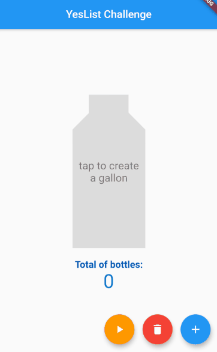

# Fill Gallon Flutter

Flutter implementation of the Yes List fill gallon" library.

# Run

To run this example you need a flutter environment and a emulator, see requirements below.

#Requirements

```
git clone https://github.com/marcelomfranca/fill_gallon_flutter
```

```
git clone https://github.com/marcelomfranca/yeslist_fill_gallon
```

To run the source code project please see:

https://flutter.dev/docs/get-started/install

https://dart.dev/get-dart

# Example 1



# Example 2


